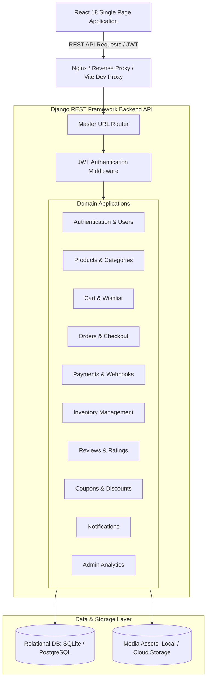
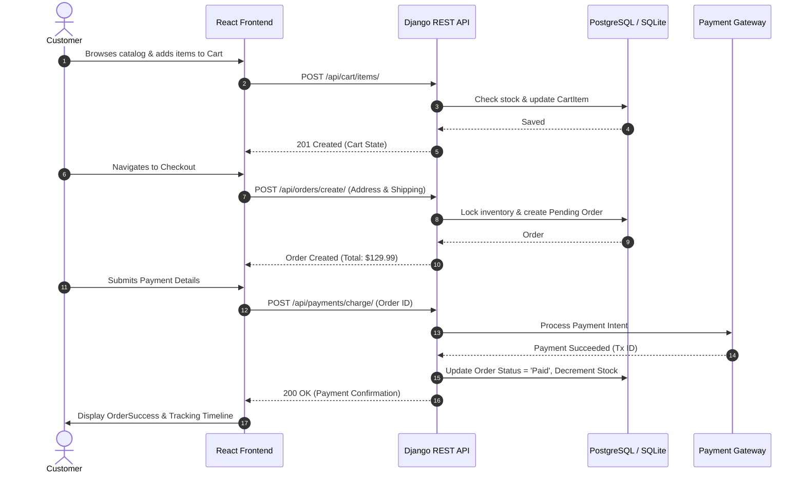

# System Architecture — SmartCart E-Commerce Platform

## 1. System Overview

SmartCart is built on a decoupled, service-oriented monolithic architecture. It separates the presentation layer (Single Page Application via React) from the backend API service (Django REST Framework), communicating via JSON over HTTP/HTTPS with stateless JWT (JSON Web Token) authentication.

---

## 2. Core Architectural Pillars

### 2.1 Decoupled Client-Server Communication
- **Stateless Communication:** Backend does not maintain server-side sessions for REST requests. Authentication relies on standard HTTP `Authorization: Bearer <access_token>` headers.
- **Token Rotation:** Uses dual-token architecture:
  - `access_token`: Short lifespan (15 minutes), used for authorizing API actions.
  - `refresh_token`: Longer lifespan (7 days), used to generate new access tokens without requiring re-login.

### 2.2 Domain-Driven Modular Django Apps
Instead of placing models and views into a bloated single app, SmartCart isolates business domains into cohesive Django apps:
1. **`authentication` & `users`:** Manages identity, registration, password hashing (Argon2 / PBKDF2), role-based permissions (Customer vs. Admin/Staff), and profile details.
2. **`categories` & `products`:** Handles catalog data, multi-attribute filtering (price ranges, categories, stock levels, rating thresholds), and product imagery.
3. **`cart` & `wishlist`:** Manages items selected by users before ordering, syncing quantities, and saving items for later.
4. **`orders` & `payments`:** Coordinates checkout flow, order state transitions (`Pending`, `Paid`, `Processing`, `Shipped`, `Delivered`, `Cancelled`), payment verification, and order receipt generation.
5. **`inventory`:** Tracks real-time stock counts, warns on low thresholds, and prevents overselling via database transactions.
6. **`reviews` & `coupons`:** User feedback with 1–5 star ratings, and discount coupon validation engines.
7. **`notifications` & `analytics`:** Transactional alerts for orders, and merchant analytics dashboard data aggregates.

---

## 3. High-Level Data Flow

### 3.1 Customer Purchasing Flow

---

## 4. Security Architecture

1. **Password Hashing:** Utilizes Django's PBKDF2 with SHA256 algorithm by default.
2. **CORS (Cross-Origin Resource Sharing):** Whitelisted origins configured in `settings.py` via `django-cors-headers`.
3. **CSRF Protection & JWT:** API routes utilize JWT tokens in `Authorization` headers, mitigating traditional browser CSRF attack vectors.
4. **Role-Based Access Control (RBAC):**
   - Public: Product browsing, category listing, login/register.
   - Authenticated User: Cart modification, checkout, order history, personal reviews.
   - Admin/Staff: Inventory adjustments, sales reports, product CRUD, user management.
5. **Input Validation:** Django REST Framework Serializers enforce strict schema validation, type checking, and sanitization before data touches the ORM layer.
