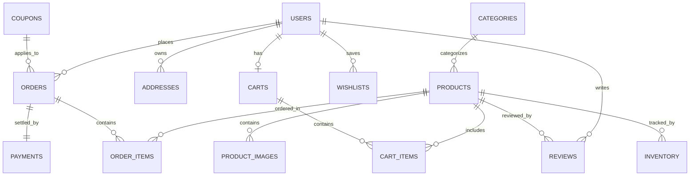

# Database Design & Schema Reference — SmartCart

## 1. Entity-Relationship (ER) Overview

SmartCart's database architecture is fully normalized (3NF), minimizing redundancy while providing indexes on high-throughput lookup paths (such as product categories, SKU codes, user orders, and cart items).

---

## 2. Table Specifications

### 2.1 `users` Table
Stores authentication credentials and core profile information.
- `id` (UUID / BIGINT PRIMARY KEY)
- `email` (VARCHAR(255) UNIQUE NOT NULL)
- `password` (VARCHAR(255) NOT NULL)
- `first_name` (VARCHAR(100))
- `last_name` (VARCHAR(100))
- `is_active` (BOOLEAN DEFAULT TRUE)
- `is_staff` (BOOLEAN DEFAULT FALSE)
- `date_joined` (TIMESTAMP WITH TIME ZONE)

### 2.2 `categories` Table
Hierarchical product categorization.
- `id` (INT PRIMARY KEY)
- `name` (VARCHAR(100) NOT NULL)
- `slug` (VARCHAR(120) UNIQUE NOT NULL)
- `parent_id` (INT NULL, FK -> `categories.id`)
- `image` (VARCHAR(255) NULL)

### 2.3 `products` Table
Primary catalog table.
- `id` (BIGINT PRIMARY KEY)
- `category_id` (INT NOT NULL, FK -> `categories.id`)
- `name` (VARCHAR(255) NOT NULL)
- `slug` (VARCHAR(280) UNIQUE NOT NULL)
- `sku` (VARCHAR(64) UNIQUE NOT NULL)
- `description` (TEXT)
- `price` (DECIMAL(10, 2) NOT NULL)
- `discount_price` (DECIMAL(10, 2) NULL)
- `stock` (INT DEFAULT 0 NOT NULL)
- `rating_avg` (DECIMAL(3, 2) DEFAULT 0.00)
- `reviews_count` (INT DEFAULT 0)
- `is_active` (BOOLEAN DEFAULT TRUE)
- `created_at` (TIMESTAMP DEFAULT CURRENT_TIMESTAMP)

### 2.4 `carts` & `cart_items` Tables
Stateful shopping carts before checkout conversion.
- `carts`: `id` (PK), `user_id` (FK -> `users.id` UNIQUE), `created_at`, `updated_at`
- `cart_items`: `id` (PK), `cart_id` (FK -> `carts.id`), `product_id` (FK -> `products.id`), `quantity` (INT NOT NULL CHECK (quantity > 0)), UNIQUE(`cart_id`, `product_id`)

### 2.5 `orders` & `order_items` Tables
Permanent record of purchases and delivery lifecycle.
- `orders`:
  - `id` (BIGINT PRIMARY KEY)
  - `order_number` (VARCHAR(32) UNIQUE NOT NULL)
  - `user_id` (BIGINT NOT NULL, FK -> `users.id`)
  - `status` (VARCHAR(20) DEFAULT 'PENDING') — `PENDING`, `PAID`, `PROCESSING`, `SHIPPED`, `DELIVERED`, `CANCELLED`
  - `total_amount` (DECIMAL(10, 2) NOT NULL)
  - `shipping_address` (TEXT NOT NULL)
  - `shipping_cost` (DECIMAL(10, 2) DEFAULT 0.00)
  - `tracking_number` (VARCHAR(64) NULL)
  - `created_at` (TIMESTAMP DEFAULT CURRENT_TIMESTAMP)
- `order_items`:
  - `id` (BIGINT PRIMARY KEY)
  - `order_id` (FK -> `orders.id` ON DELETE CASCADE)
  - `product_id` (FK -> `products.id`)
  - `product_name` (VARCHAR(255) NOT NULL)
  - `price` (DECIMAL(10, 2) NOT NULL)
  - `quantity` (INT NOT NULL)

### 2.6 `payments` Table
Records payment intents and transaction receipts.
- `id` (BIGINT PRIMARY KEY)
- `order_id` (FK -> `orders.id` UNIQUE)
- `transaction_id` (VARCHAR(128) UNIQUE NOT NULL)
- `payment_method` (VARCHAR(50) NOT NULL) — e.g. `CARD`, `PAYPAL`, `COD`
- `amount` (DECIMAL(10, 2) NOT NULL)
- `status` (VARCHAR(20) NOT NULL) — `PENDING`, `COMPLETED`, `FAILED`, `REFUNDED`
- `created_at` (TIMESTAMP DEFAULT CURRENT_TIMESTAMP)

---

## 3. Database Indexes Strategy
1. **B-Tree Indexes:**
   - `products(category_id, is_active)` for category page filtering.
   - `products(price)` for range queries (`min_price`, `max_price`).
   - `orders(user_id, status)` for customer order lookups.
   - `cart_items(cart_id, product_id)` for lightning-fast cart operations.
2. **Text Search:** Full-text / trigram indexing on `products(name, description)`.
